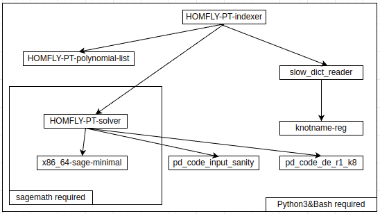

# HOMFLY-PT-indexer
根据 HOMFLY-PT 多项式，将 PD_CODE 转化为扭结名称。`clone` 本项目时请注意指明 `--recursive`。

## 前置条件

- 处理器架构必须为 `x86_64`
- `python3`

## 使用方式

- `python3 ./src/main.py`
  - 向标准输入输入一个 list of list 作为 PD_CODE
  - 程序会将检索到的扭结名称输出到标准输出，每行一个

## 依赖关系图

