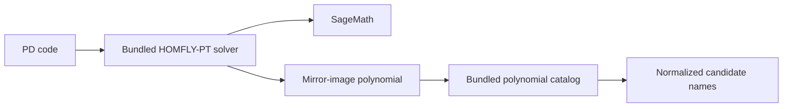

# HOMFLY-PT-indexer

Identify catalogued knots from a planar diagram (PD) code by computing its
mirror-image HOMFLY-PT polynomial and looking up all matching names.

HOMFLY-PT is not a complete knot invariant. A result can contain several names,
and an empty result means only that the polynomial is absent from this
repository's catalog—not that the input is invalid.

## Requirements

- Python 3.10 or newer
- SageMath (`sage` on `PATH`, or pass an explicit path)

On Windows, `--sage` and `sage_path` also accept a WSL URI such as
`wsl://Ubuntu-26.04/home/user/miniforge3/envs/math_env/bin/sage`.

The unknot fast path does not start SageMath. The repository is independently
cloneable: all organization dependencies are regular tracked files, not Git
submodules. Bash is not required by the Python orchestration.

## Command-line usage

```bash
echo '[[1, 5, 2, 4], [3, 1, 4, 6], [5, 3, 6, 2]]' | python src/main.py
```

Each candidate name is printed on its own line. Optional backend controls:

```bash
python src/main.py --sage /path/to/sage --timeout 120
```

Invalid input and backend failures produce a diagnostic and exit status 2.
Input is parsed with `ast.literal_eval`, never `eval`.

## Python API

```python
from homflypt_indexer import homflypt_indexer

candidates = homflypt_indexer(pd_code, sage_path="sage", timeout=120)
```

## Pipeline


```mermaid
flowchart LR
    A["PD code"] --> B["Bundled HOMFLY-PT solver"]
    B --> C["SageMath"]
    B --> D["Mirror-image polynomial"]
    D --> E["Bundled polynomial catalog"]
    E --> F["Normalized candidate names"]
```

The solver safely validates and simplifies the PD code, handles the unknot as
`1`, and compensates for Sage PD-orientation convention changes with a fixed
trefoil reference. The 1,871-line catalog is parsed and normalized once per
process. Duplicate canonical names are removed while preserving source order.

The bundled solver is invoked as a local program using a fixed tracked path;
no code modifies `sys.path` or invokes Git submodule commands. See
`VENDORED_DEPENDENCIES.md` for all audited revisions.

## Development

```bash
python -m unittest discover -s tests -v
```

The end-to-end unknot test does not require SageMath. Set
`TKI_SAGE_EXECUTABLE` to include real Sage calculations and catalog lookups for
the trefoil and figure-eight knot. No PyPI publication is performed as part of
repository maintenance.
